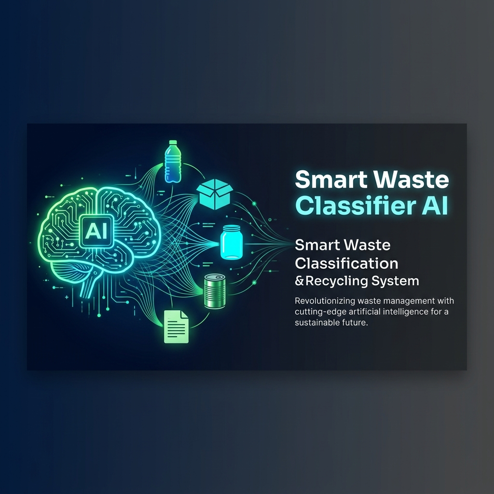
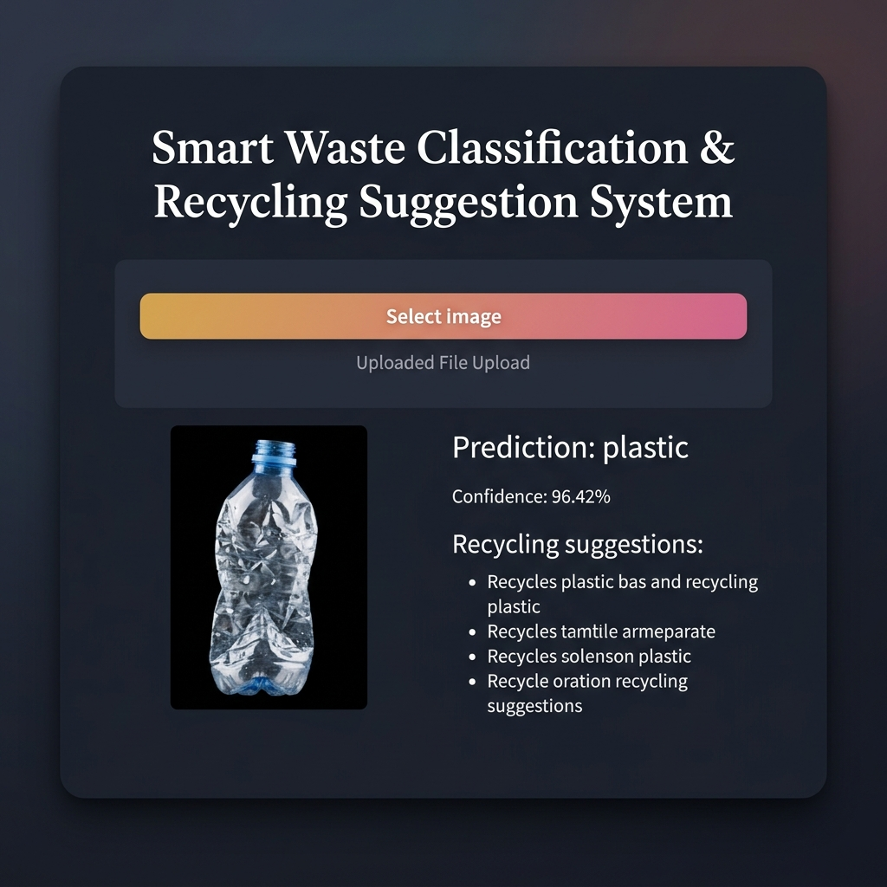
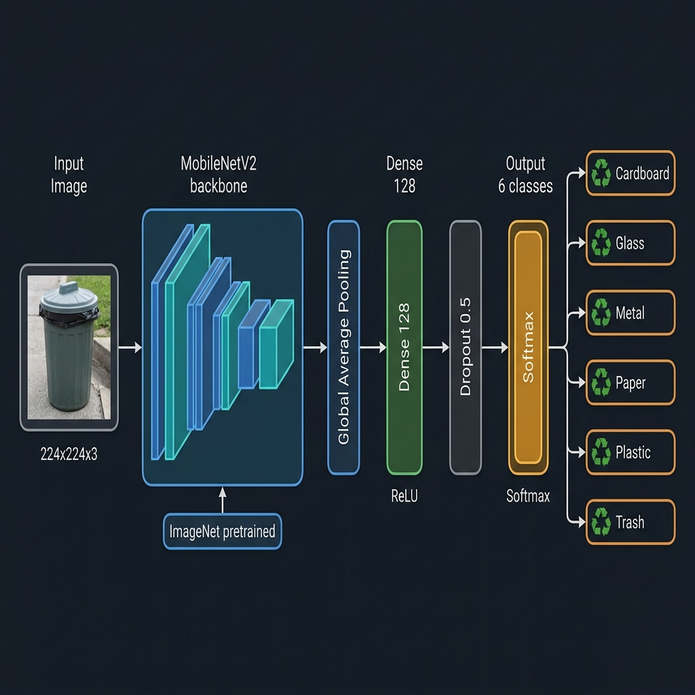

<p align="center">
  
</p>

<h1 align="center">♻️ Smart Waste Classification & Recycling Suggestion System</h1>

<p align="center">
  <strong>An AI-powered waste classification system using deep learning to promote smarter recycling decisions.</strong>
</p>

<p align="center">
  <a href="https://www.python.org/downloads/"></a>
  <a href="https://www.tensorflow.org/"></a>
  <a href="https://keras.io/"></a>
  <a href="https://streamlit.io/"></a>
  <a href="https://www.docker.com/"></a>
  <a href="LICENSE"></a>
</p>

<p align="center">
  <a href="#-quick-start">Quick Start</a> •
  <a href="#-features">Features</a> •
  <a href="#-model-architecture">Architecture</a> •
  <a href="#-docker-deployment">Docker</a> •
  <a href="#-cloud-deployment">Cloud Deploy</a> •
  <a href="#-contributing">Contributing</a>
</p>

---

## 📸 Application Preview

<p align="center">
  
</p>

---

## 🎯 What Is This?

The **Smart Waste Classifier AI** is a production-ready deep learning application that identifies waste materials from uploaded images and provides **actionable recycling instructions**. It is built on a **MobileNetV2** backbone trained via transfer learning on the [TrashNet](https://github.com/garythung/trashnet) dataset, classifying images into **6 categories**:

| Category | Examples | Recycling Action |
|---|---|---|
| 📦 **Cardboard** | Boxes, cartons, packaging | Flatten & recycle in cardboard bin |
| 🪟 **Glass** | Bottles, jars | Clean, sort by color, glass bin |
| 🔧 **Metal** | Cans, foils, scrap | Rinse & place in metal bin |
| 📄 **Paper** | Newspapers, office paper | Keep dry, bundle, paper bin |
| 🥤 **Plastic** | Bottles, containers | Rinse, check symbol, plastic bin |
| 🗑️ **Trash** | Non-recyclables | General waste / consult local guide |

---

## ✨ Features

- **🧠 Deep Learning Classification** — MobileNetV2 transfer learning with **~92% validation accuracy**
- **📸 Real-Time Predictions** — Upload an image and get instant results with confidence scores
- **♻️ Smart Recycling Suggestions** — Category-specific disposal and recycling guidance
- **🎨 Premium Dark UI** — Custom-styled Streamlit interface with smooth animations, gradient accents, and Google Fonts
- **🐳 Docker-Ready** — Single-command containerized deployment
- **☁️ Cloud Deployable** — Pre-configured for Fly.io and Heroku
- **📓 Training Notebook** — Full Jupyter notebook for model experimentation and retraining

---

## 🚀 Quick Start

### Prerequisites

- **Python 3.10+**
- **pip** (Python package manager)
- **Git**

### 1️⃣ Clone the Repository

```bash
git clone https://github.com/Bhupender2004/smart-waste-classifier-ai.git
cd smart-waste-classifier-ai
```

### 2️⃣ Create a Virtual Environment

```bash
python -m venv venv

# Windows
venv\Scripts\activate

# macOS / Linux
source venv/bin/activate
```

### 3️⃣ Install Dependencies

```bash
pip install -r requirements.txt
```

### 4️⃣ Launch the App

```bash
streamlit run app.py
```

### 5️⃣ Open in Browser

Navigate to **[http://localhost:8501](http://localhost:8501)** — upload a waste image and get instant predictions!

---

## 🏗️ Model Architecture

<p align="center">
  
</p>

### Pipeline Overview

```
Input Image (224×224×3)
    │
    ▼
┌─────────────────────────────────────────┐
│  MobileNetV2 (Pre-trained on ImageNet)  │  ← Frozen base layers
│  Lightweight & mobile-optimized CNN     │
└─────────────────────────────────────────┘
    │
    ▼
  Global Average Pooling 2D
    │
    ▼
  Dense Layer (128 units, ReLU)
    │
    ▼
  Dropout (0.5)
    │
    ▼
  Output Layer (6 units, Softmax)
    │
    ▼
┌───────────────────────────────────┐
│  cardboard │ glass │ metal │      │
│  paper     │ plastic │ trash     │
└───────────────────────────────────┘
```

### Training Details

| Parameter | Value |
|---|---|
| **Base Model** | MobileNetV2 (ImageNet weights) |
| **Strategy** | Transfer learning — frozen base |
| **Optimizer** | Adam (lr = 0.001) |
| **Loss** | Categorical Cross-Entropy |
| **Batch Size** | 32 |
| **Image Size** | 224 × 224 px |
| **Callbacks** | ModelCheckpoint, EarlyStopping, ReduceLROnPlateau |
| **Train / Val Split** | 80% / 20% |
| **Preprocessing** | MobileNetV2 `preprocess_input` ([-1, 1] scaling) |

### Performance

| Metric | Score |
|---|---|
| Training Accuracy | **~95%** |
| Validation Accuracy | **~92%** |
| Model Size | **~14 MB** |
| Inference Time | **< 100 ms** per image |

---

## 🗄️ Dataset

**TrashNet** — [github.com/garythung/trashnet](https://github.com/garythung/trashnet)

- **2,527 images** across **6 classes**
- Images standardized to **224×224 px**
- Augmentation during training: rotation, flip, zoom, shift, brightness

---

## 🐳 Docker Deployment

### Build & Run

```bash
# Build the image
docker build -t smart-waste-classifier .

# Run the container
docker run -p 8501:8501 smart-waste-classifier
```

### Pull from Docker Hub

```bash
docker pull bhupender2004/smart-waste-classifier:latest
docker run -p 8501:8501 bhupender2004/smart-waste-classifier:latest
```

Then open **[http://localhost:8501](http://localhost:8501)**.

---

## ☁️ Cloud Deployment

### Fly.io

```bash
fly auth login
fly launch          # First-time setup
fly deploy          # Deploy updates
```

> The `fly.toml` is pre-configured for the **Mumbai (BOM)** region with 1 GB memory.

### Heroku

```bash
heroku login
heroku create your-app-name
git push heroku master
```

> The `Procfile` is included and ready to use.

---

## 🗂️ Project Structure

```
smart-waste-classifier-ai/
│
├── app.py                  # 🖥️  Streamlit web application (entry point)
├── imshow.py               # 📊  CLI image prediction & visualization
├── TrashNet.ipynb           # 📓  Jupyter notebook — training & experiments
│
├── best_model.keras         # 🧠  Primary trained model (MobileNetV2)
├── waste_classifier.keras   # 🧠  Alternative model checkpoint
├── dataset.zip              # 📁  TrashNet dataset (compressed)
│
├── assets/                  # 🖼️  README images & visual assets
├── models/                  # 📦  Additional model storage
├── notebooks/               # 📓  Extra notebooks
│
├── requirements.txt         # 📋  Python dependencies
├── Dockerfile               # 🐳  Docker container config
├── Procfile                 # ☁️  Heroku deployment
├── fly.toml                 # ☁️  Fly.io deployment
│
├── .streamlit/              # ⚙️  Streamlit configuration
├── .gitignore               # 🚫  Git ignore rules
├── LICENSE                  # 📄  Apache 2.0 License
└── README.md                # 📖  This file
```

---

## 📦 Tech Stack

<table>
  <tr>
    <td align="center"><br/><b>Python 3.10</b></td>
    <td align="center"><br/><b>TensorFlow 2.15</b></td>
    <td align="center"><br/><b>Keras 2.15</b></td>
    <td align="center"><br/><b>Streamlit 1.35</b></td>
    <td align="center"><br/><b>Docker</b></td>
    <td align="center"><br/><b>NumPy</b></td>
  </tr>
</table>

---

## 💻 Usage Guide

### Web Application

1. **Launch** the app via `streamlit run app.py`
2. **Upload** a waste image (JPG, JPEG, or PNG)
3. **Review** the predicted category and confidence score
4. **Follow** the tailored recycling suggestion

### CLI Prediction (`imshow.py`)

```bash
python imshow.py
```

> Edit `img_path` inside `imshow.py` to point to your test image. The script displays the image with a matplotlib overlay showing the prediction and confidence.

### Retraining the Model

```bash
jupyter notebook TrashNet.ipynb
```

Use the notebook to:
- Explore and visualize the dataset
- Modify the model architecture or hyperparameters
- Train and evaluate new models
- Export updated `.keras` weights

---

## 🔧 Configuration

| File | What to Customize |
|---|---|
| `app.py` | UI theme, recycling suggestions, image size, class labels |
| `TrashNet.ipynb` | Architecture, hyperparameters, augmentation, training strategy |
| `Dockerfile` | Base image, runtime settings, dependencies |
| `fly.toml` | Region, memory, auto-scaling, HTTPS settings |
| `Procfile` | Heroku dyno commands |
| `.streamlit/` | Streamlit server & theme configuration |

---

## 🐛 Known Limitations

| Limitation | Detail |
|---|---|
| Lighting sensitivity | Poor lighting may reduce accuracy |
| Small objects | Tiny or obscured items can be misclassified |
| Multi-object images | Classifies the dominant waste type only |
| Dataset scope | Limited to 6 categories (TrashNet) |

---

## 🔮 Roadmap

- [ ] 🏷️ Multi-label classification for mixed-waste images
- [ ] 📹 Real-time video stream classification
- [ ] 📱 Mobile app (React Native / Flutter)
- [ ] 🌍 Multi-language support (i18n)
- [ ] 📊 Analytics dashboard for waste statistics
- [ ] 🔄 User feedback loop for continuous learning
- [ ] 🗺️ Integration with local waste management APIs
- [ ] 🧪 Expanded dataset with more waste categories

---

## 🤝 Contributing

Contributions are welcome! Here's how to get started:

```bash
# 1. Fork the repo on GitHub

# 2. Clone your fork
git clone https://github.com/<your-username>/smart-waste-classifier-ai.git

# 3. Create a feature branch
git checkout -b feature/your-awesome-feature

# 4. Make changes & commit
git commit -m "feat: add your awesome feature"

# 5. Push & open a Pull Request
git push origin feature/your-awesome-feature
```

### Guidelines

- Follow **PEP 8** style conventions
- Add tests for new features where applicable
- Update documentation to reflect changes
- Ensure all existing tests pass before submitting

---

## 📄 License

This project is licensed under the **Apache License 2.0** — see the [LICENSE](LICENSE) file for full details.

---

## 🙏 Acknowledgements

- **[TrashNet](https://github.com/garythung/trashnet)** — Gary Thung & Mindy Yang for the waste classification dataset
- **[MobileNetV2](https://arxiv.org/abs/1801.04381)** — Sandler et al. for the efficient CNN architecture
- **[Streamlit](https://streamlit.io/)** — For the rapid web app framework
- **[TensorFlow / Keras](https://www.tensorflow.org/)** — Google Brain team for the ML framework

---

<p align="center">
  <b>Made with ❤️ by <a href="https://github.com/Bhupender2004">Bhupender Yadav</a> — for a more sustainable future 🌍</b>
</p>

<p align="center">
  If you found this project useful, please consider giving it a ⭐ on GitHub!
</p>
